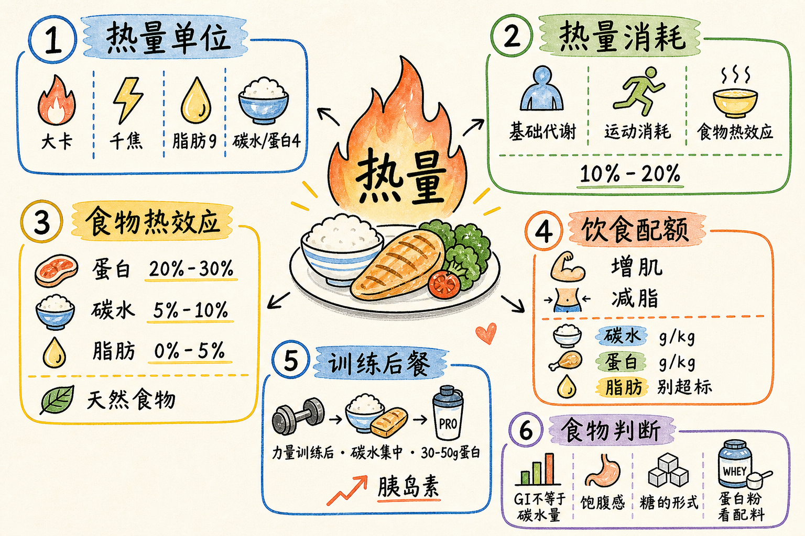

> 热量相关理论
<!--more-->

## 热量单位

日常说的“卡路里”经常会有点混乱。严格来说，卡路里是很小的单位，平时口语里说“500 卡路里”，多数时候其实是在说 500 大卡。

- 1 千卡 = 1 大卡 = 1000 卡路里。
- 1 大卡约等于 4.184 千焦。
- 国内食品包装上更常见的能量单位是千焦。

比如一盒牛奶标着每 100g 能量 277 千焦，换算下来大约是 66.2 大卡：

| 营养素 | 含量 | 热量估算 |
| --- | ---: | ---: |
| 蛋白质 | 3.6g | 约 14.4 大卡 |
| 脂肪 | 3.6g | 约 32.4 大卡 |
| 碳水化合物 | 4.7g | 约 18.8 大卡 |

三项加起来大约是 65.6 大卡，和包装上的总能量基本能对上。这里也能看出来，脂肪的热量密度最高，1g 脂肪大约 9 大卡，而 1g 蛋白质或碳水大约 4 大卡。

## 热量消耗

一天的热量消耗，可以粗略拆成三部分：

- 基础代谢。
- 运动消耗。
- 食物热效应。

饮食安排也可以从这个基础上做增减。增肌期通常在维持热量上增加 10%~20%，减脂期则减少 10%~20%。这个比例更适合作为起点，后面还要根据体重、围度和训练状态继续调整。

## 食物热效应

食物吃进去以后，身体在消化、吸收、分解和利用这些营养时，也会消耗一部分热量，这就是食物热效应。

不同营养素的热效应差别比较明显：

- 蛋白质：约 20%~30%。
- 碳水：约 5%~10%。
- 脂肪：约 0%~5%。
- 混合饮食：整体大约按 10% 估算。

所以高蛋白饮食对控制体重会更友好一些，并不只是因为蛋白质更顶饿，也和它本身的热效应更高有关。相反，如果长期过度节食，食物热效应减少，整体代谢也容易跟着下降。

天然食物通常比精加工食物更难消化一点，热效应也会更高一些。

## 水盐平衡

高盐饮食会影响身体的水盐平衡和渗透压。盐吃多了以后，人会更容易口渴，身体也会倾向于留住更多水分，血容量上升后，血压也可能被推高。日常还是要控制盐的摄入，尤其是加工食品里的隐形盐。

反过来，如果长期低盐、无盐，又大量喝水，身体为了维持渗透压，也可能出现不舒服的状态。比如长时间跑马拉松，大量出汗却只补水不补电解质，就可能出现轻微脱水，整个人看起来也会更干。

## 经验化饮食配额

下面这些数值更像经验起点，适合用来估算每日每公斤体重需要多少营养素。

增肌期：

- 男性：碳水 3.5~4.5g，蛋白质 1.5~2g，脂肪 1g。
- 女性：碳水 3~3.5g，蛋白质 1.5g，脂肪 1g。

减脂期：

- 男性：碳水 2.5~3g，蛋白质 1.5g，脂肪 0.8g。
- 女性：碳水 2.5~3g，蛋白质 1.2g，脂肪 0.8g。

## 常见食物的碳水和蛋白

主食的碳水比例会受生熟状态影响很大：

- 生米：约 75% 碳水。
- 熟米饭：约 30% 碳水。
- 生面条：约 70% 碳水。
- 熟面条：约 23% 碳水。

肉类主要看蛋白质：

- 生肉：约 20% 蛋白质。
- 炒熟的肉：约 25% 蛋白质。
- 卤、炖后的肉：约 30% 蛋白质。

蔬菜里，根茎类的碳水会明显高一些，比如土豆、红薯大约在 10%~20%。其他普通蔬菜的碳水通常可以粗略忽略。

水果的碳水也有差异：

- 香蕉、榴莲：20% 以上。
- 苹果、梨、蓝莓：约 14%。
- 菠萝、桃、柑、橘：约 10%。
- 西瓜、草莓：约 7%。

## 训练后餐和胰岛素

增肌期做完力量训练后，练后餐可以安排得更集中一些：全天 40%~50% 的碳水，再加 30~50g 蛋白质，同时少吃或不吃蔬菜。这样做的目的，是让胰岛素水平升得更明显，帮助营养进入肌肉。

但这个策略更适合力量训练后。如果不是力量训练日，单纯把胰岛素拉高，更容易变成增脂，而不是增肌。

平时吃饭如果想让血糖和胰岛素更稳定，可以按“蔬菜、肉类、碳水”的顺序吃。大体上，碳水最容易升胰岛素，其次是蛋白质，脂肪最弱。膳食纤维可以延缓胃排空，让氨基酸和血糖进入血液的速度更平缓。

减脂期优先减少其他餐的碳水，练后餐可以先不动。休息日或有氧日，可以把碳水降低 1~1.5g/kg。如果训练采用三分化以上，手臂、肩膀这类小肌群训练后的碳水，也可以适当少一些。

## GI 和饱腹感

GI 是升糖指数，表示食物让血糖升高的速度。GI 越高，升糖越快。但它和“这个食物有多少碳水”不是一回事。

比如白米饭、馒头属于高 GI 食物，香蕉一般算中 GI。淀粉类食物糊化程度越高，GI 往往也越高。

饱腹感又是另一件事。碳水含量高，不一定就不顶饿；GI 高，也不代表一定不抗饿。燕麦、红薯的饱腹感就不错。

练后餐一般会选择高 GI 碳水。日常生活里，大多数常见主食其实都偏快碳。

## 鸡蛋、牛奶和脂肪

一个鸡蛋大约有 6g 蛋白质和 5g 脂肪。蛋白质大致一半来自蛋清，一半来自蛋黄；脂肪主要在蛋黄里。

脂肪容易超标的食物主要有几类：

- 煎炸食物和重油炒菜。液体脂肪很容易被忽略，鸡蛋、茄子这类食材尤其容易吸油。
- 糖油混合物，比如糕点、零食。
- 坚果。

鸡蛋和牛奶虽然是很常见的健身食物，但脂肪和蛋白质含量往往是同时存在的。吃的时候要算进去，不然脂肪很容易不知不觉超标。

## 糖的几种形式

常见单糖主要有果糖和葡萄糖。

果糖的 GI 比较低，少部分可以转化为葡萄糖，主要来自水果。葡萄糖的 GI 记作 100，水果和很多加工食品里都会出现。

果葡糖浆不是单糖，也不是多糖。它是果糖和葡萄糖混合在一起的游离态糖浆，中间没有化学键连接，常见于食品添加和工业加工。常见比例大概是 45/55。

双糖主要有几类：

- 蔗糖：果糖 + 葡萄糖，也就是白砂糖的主要成分，水果和食品添加里也常见，比例大致各半。
- 麦芽糖：葡萄糖 + 葡萄糖，常见于食品添加，GI 约等于 100。
- 乳糖：葡萄糖 + 半乳糖，需要乳糖酶分解。

乳糖不耐受的核心原因，是乳糖酶缺乏或活性不足。没有被充分分解的乳糖进入大肠后，会被肠道菌群发酵，产生气体和酸性物质，于是出现腹胀、腹泻、腹痛等症状。是否乳糖不耐受，可以通过医学检测确认。

计算加工食品里的果糖时，要注意这些糖之间的换算关系。

果糖或含果糖的食物适合少量摄入。葡萄糖主要通过糖酵解和三羧酸循环被氧化，用来生成 ATP，肌肉和大脑都很依赖它。剩余的葡萄糖可以在肝脏里转化为肌糖原和肝糖原，这个过程依赖胰岛素。

果糖则不依赖胰岛素，几乎全部由肝脏代谢，其中一部分可能转化为甘油三酯。长期过量摄入果糖，和脂肪肝、肥胖、痛风等问题有关。

## 蛋白粉

蛋白粉包装上常见几个词：

- whey：乳清蛋白粉。
- isolate / iso：分离乳清蛋白粉，通常会去掉更多乳糖。
- mass / gain / gainer：更接近增肌粉，里面往往加了快碳，蛋白粉含量可能不到 30%。

前面讨论的是高蛋白含量的蛋白粉，不是增肌粉。买的时候要注意看配料表和营养成分表。

