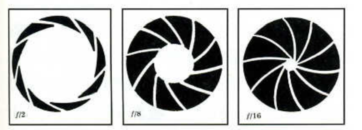

记录对摄影的学习过程
<!--more-->

## 镜头
为什么要有镜头，这就首先要认识下照相机的工作原理：小孔成像
>小孔成像：用一个带有小孔的板遮挡在墙体与物之间，墙体上就会形成物的倒立实像，这样的一种现象叫小孔成像。前后移动中间的板，墙体上像的大小也会随之发生变化，这种现象说明了光沿直线传播的性质。
>- 小孔成的像为什么是倒立？光是沿直线传播的，所以在一个平面上，平面下方的光线穿过平面不会出现在同侧，而是会出现在平面的另一侧
>- 像的大小和哪些因素有关？对于孔大小不变的情况下，像距不变，增加物距则像的清晰度（也即分辨率）会变低；物距不变而像距增加，那么成像分辨率会上升，相反则分辨率下降，所以当像距极小的情况下，物体在像上的表现就是一个光斑   
>
>- 像的清晰程度和哪些因素有关？当孔越小时，则像越清晰，因为孔变大时，不同角度发出的光是会重叠的如下，可以发现不同方向射出的光线经过小孔最终到达C点时汇聚到了一起，也就是重叠；并且孔的大小是相对于物体而言的，如果物体比孔还大，则无法成像    
>

虽然针孔照相机（顾名思义镜头是一个小孔）的工作特性简单，但是产生出来的影响确并不能令人满意，原因是：
- 即使在最好的环境条件下，胶片上形成的影像也不能尽如人意
- 由于通过针孔进入的光量只是很少一部分，所以充分的胶片曝光往往需要数小时,（如下芬兰艺术家Tarja Trygg以针孔相机，拍摄日照轨迹（Solargraphy），曝光时间长达6个月）   
  

镜头的出现就解决了上面两个问题，首先镜头可以帮助汇聚光束，所以可以在胶片上产生清晰的影像，其次镜头可以短时间内接受大量的光线，只需要很少的时间即可获得适当的曝光！

镜头的基本功能：让光线进入照相机并聚焦光线，在胶片上形成清晰的影像

而镜头的不同又分出了几种派别的照相机，`定焦照相机`、`变焦照相机`、`自动聚焦照相机`等

### 镜头速度&光圈
镜头的速度是指特定的镜头在特定的而时间内所能传送的光量的多少，这个传送的`快`和`慢`咋理解呢，这里的快慢并不是说镜头能捕捉运动物体的快慢能力，而是指单位时间内，镜头能捕捉到的光量的多少

**如何查看镜头速度**:我们一般看镜头光圈的大小来看镜头的速度大小，光圈越大，镜头速度越高；反之镜头速度越低，**那么如何表示光圈呢？**    

光圈的大小一般使用`f值`来表示：`光圈f值`=`镜头的焦距`除以`光圈口径`，可以看出控制变量的情况下，**焦距不变，光圈口径越大，f值越小**   
如下图其中白色的部分就是接受的光量的孔大小，可以看出f后面跟着的数值越小，镜头速度越高
其中f值分为这么几个数值：`f/1`、`f/1.4`、`f/2`、`f/2.8`、`f/4`、`f/5.6`、`f/8`...可以看出，每个数值和前面的除数都是`根号2`,所以光圈口径每扩大`根号2`倍，进的光量扩大2倍（圆面积与半径是平方的增长关系）

### 焦距
焦距也是镜头的其中一个特性，镜头的焦距是指从该透镜（可能由不止一个镜头组成）的中心点到形成焦点的距离，焦距越短，则拍摄的范围越广；焦距越长，则拍摄的物体在胶片上形成的影像就越清晰，范围就越小，拍摄的主体也更大

根据焦距可以划分为`定焦镜头`和`变焦镜头`两种
>变焦原理：光学变焦就是通过移动镜头内部镜片来改变焦点的位置，改变镜头焦距的长短，并改变镜头的视角大小，从而实现影像的放大与缩小。所以一般变焦镜头会通过转动镜头筒来实现变焦

根据焦距的距离（一般是毫米作为计量单位）不同，分为几种比如`28mm`、`105mm`、`135mm`、`200mm`等镜头（代表的是焦距），所以数值越大，镜头就越长

**光圈和焦距的关系：** 光圈的大小和焦距的长短都可以影响单位时间内进入相机光量的大小的，如果每次拍照时都要考虑这两个因素来计算曝光的大小会非常复杂，所以前面提到的f值体系应运而生，当f值相同的时候，曝光一定是相同的，比如调节焦距的话，相机会自动调整光圈的大小来保证f值不变

### 标准镜头 vs 广角镜头 vs 远摄镜头 vs 鱼眼镜头

**标准镜头**：是否`标准`取决于底片的大小，一般来说比如35mm的底片，对角线长是50mm左右，所以50mmm左右的镜头都可以认为是标准镜头，但这只是一个判断的标准，我们应当明确的是，焦距越长，越偏向远摄；越短，越偏向广角   

**远摄镜头**：一般是大于135mm的就属于远摄镜头了
- 适用场景：拍特写镜头，比如野生动物或者某些体育项目等
- 长镜头的缺点：
  - 贵，且大而笨重
  - 焦距越长，照相机就必须越稳定，需要适用三脚架等保证影像的质量，一般来说，当快门速度低于1/200就不能手持100mm的相机拍摄了（为了影像更锐利，快门速度越快越好，快门的速度一般的数值是镜头焦距两倍的倒数）    

注：
>远摄增距镜（既要又要）：安装在镜头和照相机之间的光学件，可以放大影像，比如一个两倍的增距镜安装在100mm的镜头上，产生的影像大小就会和200mm的一样，但 这是以损失一部分影像的清晰度为代价的，需要摄影者做一些权衡

>**最后请切记！！！**：无论任何情况下，都不可以将远摄镜头直接对准太阳，因为远摄镜头本质上也是一种望远镜，直视时会汇聚热量和红外线，可能会造成眼睛的灼伤和镜头的损坏

**广角镜头**：一般小于35mm的就属于广角镜头了，拍摄的范围非常广，比较适合拍一些风景，建筑等景观题材

**鱼眼镜头**：一般小于16mm的就属于广鱼眼镜头，焦距极短，可拍摄的范围能接近180度，拍摄的效果可以看看家里门上的`猫眼`（但角度一般小一些），鱼眼镜头范围更广

### 微距镜头
微距镜头是一种可以非常接近被摄体进行聚焦的镜头，并且会在胶片上形成与真实的被摄体大小的`1：1`、`1：2`、`1：3`（比如1：2表示胶片的影像是实物的一半）

### 畸变（待补充）
#### 透视畸变
近小远大
#### 线性畸变

## 部分概念
胶片和芯片： 都是用来接受光线并成像的感光材料

## 引用
- 《美国纽约摄影学院摄影教材》
- [小孔成像](https://baike.baidu.com/item/%E5%B0%8F%E5%AD%94%E6%88%90%E5%83%8F/866213)
- [针孔相机](https://zh.wikipedia.org/wiki/%E9%87%9D%E5%AD%94%E7%9B%B8%E6%A9%9F)
- [光圈](https://zh.m.wikipedia.org/zh-hans/%E5%85%89%E5%9C%88)
- [变焦镜头](https://baike.baidu.com/item/%E5%8F%98%E7%84%A6%E9%95%9C%E5%A4%B4/2971419)