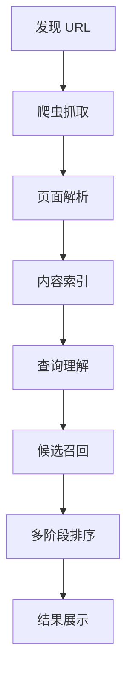

> 搜索引擎不是实时去全网翻网页，而是先抓取、建索引，再在查询时召回和排序。
<!--more-->

## 搜索引擎的核心

搜索引擎主要做三件事：网页抓取、索引、排序。

可以把它想成一个超大规模的网页图书馆。爬虫先去互联网上收集网页，把内容整理成适合检索的数据结构。用户搜索时，系统不会临时遍历整个互联网，而是在已经建好的索引里快速找候选结果，再根据相关性、权威性、内容质量、时效性和用户体验等信号排序。



## 网页抓取

### 为什么要提前抓取

互联网网页数量太大。如果用户每次搜索时，搜索引擎才临时访问网页，不可能在几百毫秒内返回结果。

所以搜索引擎会提前抓取网页，并提前构建索引。搜索发生时，主要查的是自己的索引库。

### 抓取相关的限制

大多数正规爬虫会遵循抓取协议，但不是所有抓取工具都会照做。`robots.txt`、`meta robots`、`X-Robots-Tag` 更像是给搜索引擎的规则，不是权限系统。如果真的不希望内容被访问，还是要靠登录、鉴权、密钥这类保护。

大致可以这样分：

- `robots.txt` 主要控制抓取。
- `meta robots` 和 `X-Robots-Tag` 主要控制索引和展示。

### robots.txt

`robots.txt` 控制爬虫能不能抓取某些 URL。它放在网站根目录，比如：

```text
https://example.com/robots.txt
```

典型写法：

```txt
User-agent: Googlebot
Disallow: /admin/
Disallow: /search
Allow: /search/help
```

含义是：

```text
不允许 Googlebot 抓取 /admin/
不允许 Googlebot 抓取 /search
但允许抓取 /search/help
```

它常用来处理这些场景：

- 限制后台路径。
- 限制站内搜索结果页。
- 限制筛选参数页。
- 避免无限 URL 被抓取。
- 节省抓取预算，减少服务器压力。

但不能把 `robots.txt` 当成 `noindex`。

假设写了：

```txt
User-agent: Googlebot
Disallow: /private/report.html
```

这表示 Googlebot 不应该抓取这个页面内容。可如果其他网页链接到了这个 URL：

```html
<a href="https://example.com/private/report.html">内部报告</a>
```

Google 仍然可能通过外部链接知道这个 URL 存在。于是会出现一种情况：Google 知道这个 URL，但没有抓到页面内容，也就没有正文、标题、meta 等内容可分析。它通常不会形成正常的内容索引，但 URL 本身可能被记录，少数情况下也可能出现在搜索结果里。

更准确地说，`robots.txt` 阻止的是抓取内容，不一定阻止 URL 被发现。

### meta robots 和 X-Robots-Tag

`meta robots` 控制页面是否允许索引。它写在 HTML 的 `<head>` 里：

```html
<meta name="robots" content="noindex">
```

意思是：允许爬虫访问这个页面，但不要把这个页面放进搜索结果。

常见写法：

```html
<meta name="robots" content="noindex">
<meta name="robots" content="nofollow">
<meta name="robots" content="noindex, nofollow">
<meta name="robots" content="nosnippet">
<meta name="robots" content="noarchive">
```

常见指令：

```text
noindex   不要索引这个页面
nofollow  不要跟踪页面上的链接
nosnippet 不要在搜索结果中显示摘要
noarchive 不显示缓存版本
```

这里有个容易踩的点：搜索引擎必须先抓到页面，才能看到 `meta robots`。如果页面已经被 `robots.txt` 禁止抓取，爬虫就看不到页面里的 `noindex`。

`X-Robots-Tag` 是 HTTP 响应头里的 robots 指令，作用和 `meta robots` 类似，只是位置不同：

```http
HTTP/1.1 200 OK
Content-Type: text/html
X-Robots-Tag: noindex
```

它很适合非 HTML 文件，比如：

```text
PDF
图片
视频
CSV
Word 文档
接口返回文件
```

这些文件没有 HTML `<head>`，不能写 meta 标签。如果要禁止 PDF 被索引，可以在响应头里加：

```http
X-Robots-Tag: noindex
```

所以一起用时要注意顺序：如果 `robots.txt` 先挡住了抓取，页面里的 `meta robots` 和响应头里的 `X-Robots-Tag` 可能根本不会被搜索引擎看到。这样反而可能出现“URL 被发现，但页面内容没有被抓取，也没法读取 noindex”的状态。

## 索引

普通索引更像这样记录：每个网页包含哪些关键词。

```text
网页 A -> 包含：苹果、手机、发布会
网页 B -> 包含：苹果、股票、公司
网页 C -> 包含：香蕉、水果、苹果
```

搜索引擎通常会反过来建索引，也就是倒排索引：

```text
苹果 -> 网页 A、网页 B、网页 C
手机 -> 网页 A
股票 -> 网页 B
香蕉 -> 网页 C
```

这样查某个词时，可以直接拿到包含它的网页集合，不用把所有网页扫一遍。互联网规模太大，逐篇文章扫描基本不可接受。Elasticsearch 这类搜索系统底层也会用倒排索引。

### 页面怎么被解析和建索引

搜索引擎抓到 HTML 后，会做一轮解析和清洗。常见步骤包括：

- 解析 HTML 结构。
- 提取 `title`、`description`、heading。
- 识别正文区域。
- 过滤导航栏、页脚、广告等噪声。
- 提取页面链接。
- 处理图片 `alt`、视频信息。
- 识别结构化数据。
- 判断 canonical 主页面。
- 检测重复内容。
- 判断语言和地区。
- 分析页面主题。

搜索引擎要判断哪些是正文，哪些只是辅助内容。最后再把页面转成适合检索和排序的数据结构。

## 查询理解

用户输入搜索词后，搜索引擎不会只做字面匹配，而是先判断用户大概想找什么。

比如搜索“苹果”，这个词本身信息量很少，可能指：

```text
苹果水果
苹果公司
iPhone
苹果股票
```

这时可能需要结合历史上下文、地域、时间、设备等信号，才能更接近用户真实意图。

不同查询的侧重点也不一样：

- “北京天气”偏实时查询，时间相关性很强。
- “Python list 去重”是技术问题，时效性相对没那么强。
- “附近咖啡店”偏本地生活，需要结合位置和周边信息。

查询理解阶段通常会做这些事：

```text
分词
拼写纠错
同义词扩展
实体识别
意图判断
地域判断
时效性判断
搜索类型判断
```

现代搜索不是简单的字符串匹配，而是关键词检索、语义理解、实体识别、链接分析和质量评估混在一起的系统。先理解查询意图，后面才知道该召回什么、怎么排序。

## 排序

### 候选召回

搜索引擎不会一开始就对全网所有页面排序，而是先做候选召回。召回阶段的目标是尽量别漏掉有价值的结果，所以会先拿到一批候选页面，后面再用排序模型筛。

比如用户搜索：

```text
Redis 缓存雪崩怎么解决
```

搜索引擎可能召回包含这些词或语义相关的页面：

```text
Redis 缓存雪崩
缓存穿透
缓存击穿
随机过期时间
限流降级
多级缓存
热点 key
缓存预热
```

### 排序信号

#### 相关性

相关性是最基础的排序因素。搜索引擎会判断页面是否真的和查询相关，不只是看关键词有没有出现，还会看：

```text
关键词是否出现在标题中
关键词是否出现在正文中
关键词是否出现在小标题中
关键词之间距离是否接近
页面整体主题是否一致
是否真正回答了用户问题
是否存在同义词或语义匹配
```

比如搜索：

```text
PostgreSQL 批量更新 JSON 字段
```

高相关页面可能包含：

```text
PostgreSQL
JSON / JSONB
UPDATE
batch update
execute_batch
psycopg2
```

但如果一个页面只是反复堆关键词，并没有解决问题，它不一定排得高。

#### 内容质量

相关不等于高质量。一个页面可以命中很多关键词，但内容仍然很差，比如：

```text
复制拼凑
标题党
内容空洞
广告过多
错误信息
没有实际解决方案
```

搜索引擎还会看内容质量：

```text
内容是否原创
解释是否完整
信息是否准确
作者或网站是否专业
是否有可信来源
页面是否对用户有实际帮助
是否过度 SEO
```

#### 链接关系和 PageRank 思路

Google 早期的重要创新之一是 PageRank。

它的思路很直接：一个页面如果被很多高质量页面链接，说明它可能更重要。类似论文引用，一篇论文被很多权威论文引用，通常说明它有影响力。

但现代搜索不会只看外链数量，还会分析：

```text
链接来源网站的质量
链接页面和目标页面是否相关
锚文本内容
链接是否自然
是否存在垃圾外链
链接网络是否异常
```

比如数据库官方文档被大量技术博客引用，它在相关查询里通常会更有权威性。

反过来，如果一个网站靠买卖链接、垃圾站群制造外链，搜索引擎也可能识别出来并降低权重。

#### 时效性

有些查询很吃时间：

```text
今天北京天气
英伟达最新财报
Chrome 最新版本问题
2026 高考分数线
某公司最新产品价格
```

这类查询里，新内容通常更重要。

但有些查询更需要稳定、经典、权威的内容：

```text
牛顿第二定律
二叉树遍历
信息熵定义
量子化是什么意思
```

这些内容不一定越新越好，准确、权威、讲清楚更重要。

#### 用户体验

页面内容好，但体验太差，也可能影响最终表现。常见问题包括：

```text
页面加载慢
移动端布局混乱
广告遮挡正文
弹窗过多
跳转异常
HTTPS 问题
恶意下载
内容不可读
```

用户体验通常不是唯一决定因素。但在内容质量和相关性接近时，体验更好的页面更占便宜。

#### 上下文和个性化

同一个关键词，不同用户搜索，结果可能不同。影响因素包括：

```text
用户所在地区
搜索语言
设备类型
当前时间
搜索历史
安全搜索设置
用户意图判断
```

比如搜索：

```text
football
```

在美国可能更偏向美式橄榄球，在英国可能更偏向足球。

搜索引擎最后呈现出来的结果，通常就是这些信号共同作用后的结果。
